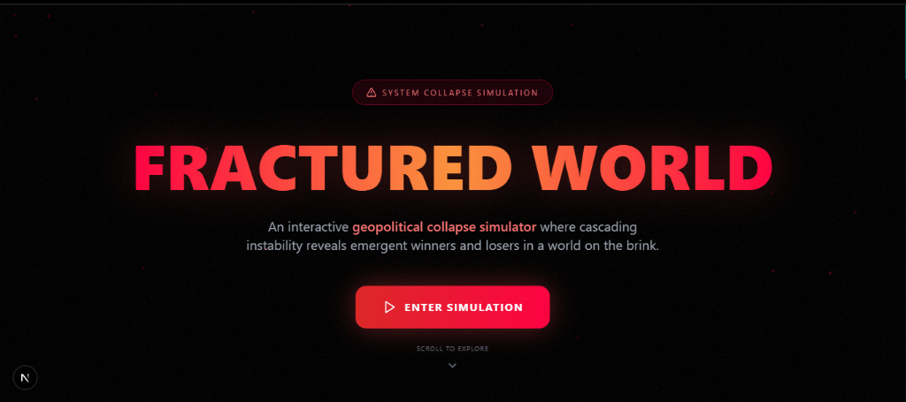
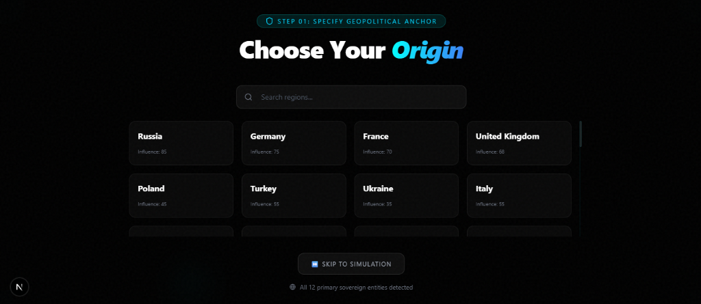
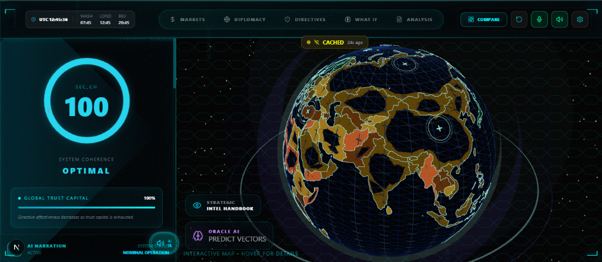
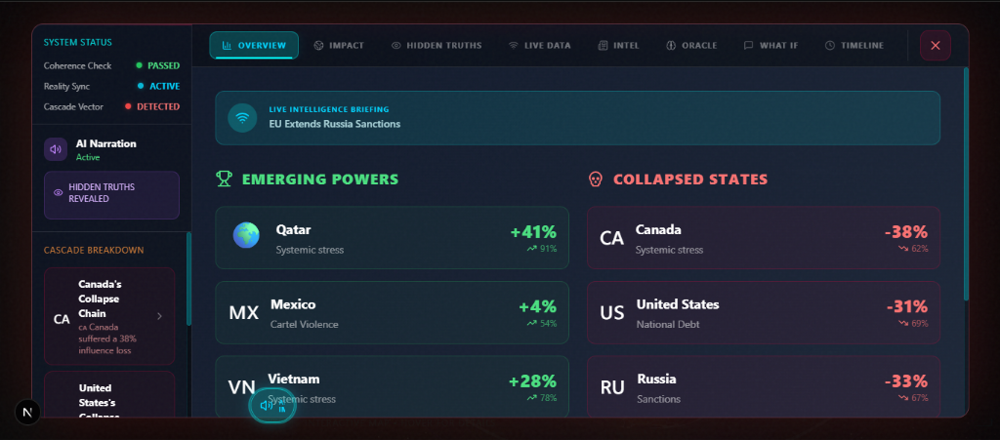
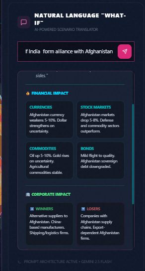

<p align="center">
  
  
  
  
  
</p>

<h1 align="center">
  🌍 FRACTURED WORLD
</h1>

<p align="center">
  <strong>An Interactive Geopolitical Collapse Simulator</strong><br/>
  <em>Emergence on Collapse: Watch new orders arise from the ruins of the old</em>
</p>

<p align="center">
  <a href="#-features">Features</a> •
  <a href="#-demo">Demo</a> •
  <a href="#%EF%B8%8F-tech-stack">Tech Stack</a> •
  <a href="#-getting-started">Getting Started</a> •
  <a href="#-architecture">Architecture</a> •
  <a href="#-acknowledgments">Acknowledgments</a>
</p>

---

## 📖 Description

**Fractured World** is a cutting-edge geopolitical simulation platform that models cascading instability across interconnected global systems. Built for the **System Collapse Hackathon (Theme: Emergence on Collapse)**, this simulator explores how economic sanctions, military tensions, and diplomatic crises propagate through complex networks of nations, revealing surprising winners and losers as order gives way to chaos.

The platform features:
- 🌐 **Interactive 3D Globe** with real geopolitical data and relationships
- ⚡ **Cascade Engine** that simulates instability propagation in real-time
- 🤖 **AI-Powered Emergence Detection** identifying unexpected outcomes
- 📊 **Comprehensive Aftermath Analysis** with hidden truths and shadow entities
- 🎮 **Executive Directives** allowing users to trigger and observe cascading effects

---

## ✨ Features

### 🌍 Global Simulation Engine
Experience a fully interactive 3D globe visualization powered by Three.js and React Three Fiber. Watch instability spread across nations in real-time with:
- **25+ Modeled Countries** with unique geopolitical profiles, vulnerabilities, and strengths
- **Complex Relationship Networks** including allies, rivals, trade partners, and energy dependencies
- **Multi-tier Nation Classification**: Superpowers, Major Powers, Regional Powers, Emerging Nations, and Vulnerable States

### ⚡ Cascade Engine
The heart of the simulation - a sophisticated engine that models:
- **Economic Sanctions** and their ripple effects across trade networks
- **Military Tensions** and alliance activation cascades
- **Energy Disruptions** propagating through supply chains
- **Phase Transitions** from stability through instability to collapse
- **Hysteresis Memory** - systems remember past shocks

### 🤖 AI Oracle & Emergence Detection
Powered by Google's Generative AI, the system provides:
- **Real-time Predictions** of cascade outcomes
- **Emergence Detection** - identifying unexpected winners and beneficiaries
- **Weakest Link Analysis** - pinpointing the most vulnerable nodes
- **Cascade Path Forecasting** - predicting how instability will spread

### 📊 Aftermath Dashboard
A comprehensive post-simulation analysis featuring:
- **Winners & Losers** - countries that emerged stronger or collapsed
- **Hidden Truths** - shadow entities and secret networks profiting from chaos
- **Timeline Analysis** - complete event chronology
- **Global Impact Reports** - detailed breakdowns of systemic changes

### 🎮 Scenario System
Pre-built and dynamic scenario generation including:
- Sanction Russia
- Block Bosphorus
- China-Taiwan Crisis
- Global Economic Crisis
- Iran Crisis
- Energy Shock
- And more...

### 🎨 Premium Visual Experience
- **Glassmorphism UI** with dark mode aesthetics
- **Matrix-style Animations** and glitch effects
- **Entropy Overlay** visualizing system chaos
- **CRT/Glitch Effects** responding to simulation state
- **Ambient Sound System** for immersive experience

---

## 🎮 Demo

### Landing Page
*Enter the simulation with a cinematic introduction*


### Geopolitical Origin Selector
*Choose your starting nation with influence ratings*


### Interactive 3D Globe Simulation
*Real-time visualization with system coherence monitoring*


### Aftermath Dashboard
*Comprehensive analysis of emerging powers vs collapsed states*


### AI-Powered "What-If" Scenarios
*Natural language scenario translator powered by Gemini 2.5 Flash*


---

Experience the simulation at: **[Your Deployment URL]**

---

## 🛠️ Tech Stack

| Category | Technologies |
|----------|-------------|
| **Framework** | Next.js 16, React 19 |
| **Language** | TypeScript 5 |
| **3D Graphics** | Three.js, React Three Fiber, React Three Drei |
| **Animations** | Framer Motion 12, CSS Animations |
| **Styling** | Tailwind CSS 3, Radix UI Components |
| **Charts** | Recharts, D3.js |
| **AI Integration** | Google Generative AI |
| **State Management** | React Context, Custom Hooks |
| **Data Visualization** | TopoJSON, D3-Delaunay |

---

## 🚀 Getting Started

### Prerequisites

- **Node.js** 18+ 
- **pnpm** (recommended) or npm

### Installation

1. **Clone the repository**
   ```bash
   git clone https://github.com/yourusername/fractured-world.git
   cd fractured-world
   ```

2. **Install dependencies**
   ```bash
   pnpm install
   # or
   npm install
   ```

3. **Set up environment variables**
   ```bash
   cp .env.example .env.local
   ```
   
   Configure your `.env.local`:
   ```env
   NEXT_PUBLIC_GEMINI_API_KEY=your_google_ai_api_key
   NEXT_PUBLIC_FIREBASE_API_KEY=your_firebase_key
   NEXT_PUBLIC_FIREBASE_PROJECT_ID=your_project_id
   ```

4. **Run the development server**
   ```bash
   pnpm dev
   # or
   npm run dev
   ```

5. **Open your browser**
   Navigate to [http://localhost:3000](http://localhost:3000)

### Build for Production

```bash
pnpm build
pnpm start
```

---

## 🏗️ Architecture

```
simulator/
├── app/                          # Next.js App Router
│   ├── page.tsx                  # Landing page
│   ├── simulator/                # Main simulation interface
│   ├── analysis/                 # Post-simulation analysis
│   └── about/                    # Project information
├── components/
│   ├── GlobeMap.tsx              # 3D Globe visualization
│   ├── FracturedWorld.tsx        # Main simulation UI
│   ├── CascadeEngine/            # Simulation engine components
│   ├── AftermathDashboard.tsx    # Post-simulation analysis
│   ├── AIOraclePanel.tsx         # AI predictions interface
│   ├── ScenarioSelector.tsx      # Scenario management
│   └── ui/                       # Reusable UI components (Radix)
├── lib/
│   ├── CascadeEngine.ts          # Core simulation logic
│   ├── EmergenceDetector.ts      # AI emergence detection
│   ├── GeopoliticalDataset.ts    # Country profiles & relationships
│   ├── AIEngine.ts               # Gemini AI integration
│   ├── liveDataService.ts        # Real-time data handling
│   └── sanctionHiddenTruths.ts   # Hidden truths data
├── hooks/                        # Custom React hooks
│   ├── useGlitchEffect.ts
│   ├── useParticleSystem.ts
│   └── usePerformanceOptimizations.ts
└── styles/                       # Global styles
```

### Core Systems

| System | File | Purpose |
|--------|------|---------|
| **Cascade Engine** | `lib/CascadeEngine.ts` | Simulates instability propagation |
| **Emergence Detector** | `lib/EmergenceDetector.ts` | AI-powered pattern detection |
| **Geopolitical Dataset** | `lib/GeopoliticalDataset.ts` | Country profiles & relationships |
| **AI Services** | `lib/AIEngine.ts` | Gemini AI integration |
| **Globe Visualization** | `components/GlobeMap.tsx` | 3D world rendering |

---

 This project was built for the **System Collapse Hackathon**, specifically exploring the theme: **Emergence on Collapse**.
 
 > *"Systems where rules drift, chaos emerges, and order collapses in beautiful ways—and from that collapse, better things arise."*
 
 ### How Fractured World Embodies "Emergence on Collapse"

1. **Deterministic Chaos**: Small perturbations cascade into massive systemic changes
2. **Emergent Behavior**: Winners and losers emerge unpredictably from complex interactions
3. **Phase Transitions**: Watch systems transition from stable → unstable → collapsed
4. **Hidden Patterns**: Discover shadow entities that thrive in chaos
5. **Feedback Loops**: Observe how instability amplifies through interconnected networks

---

## 🎹 Keyboard Shortcuts

| Key | Action |
|-----|--------|
| `?` | Toggle help overlay |
| `Space` | Pause/Resume simulation |
| `R` | Reset simulation |
| `S` | Take screenshot |
| `A` | Toggle Aftermath Dashboard |
| `1-5` | Switch dashboard tabs |

---

## 📱 Responsive Design

The simulator is fully responsive and optimized for:
- 🖥️ Desktop (Full 3D globe experience)
- 💻 Laptop (Optimized performance mode)
- 📱 Mobile (Simplified interface with touch controls)

---

## 🔮 Future Roadmap

- [ ] **Multiplayer Mode** - Compete as different nation leaders
- [ ] **Historical Scenarios** - Replay historical crises
- [ ] **Custom Scenario Builder** - Create your own geopolitical events
- [ ] **API Access** - Embed simulation in other applications
- [ ] **VR Support** - Immersive 3D world experience

---

## 🤝 Contributing

Contributions are welcome! Please feel free to submit a Pull Request.

1. Fork the repository
2. Create your feature branch (`git checkout -b feature/AmazingFeature`)
3. Commit your changes (`git commit -m 'Add some AmazingFeature'`)
4. Push to the branch (`git push origin feature/AmazingFeature`)
5. Open a Pull Request

---

## 🙏 Acknowledgments

- **System Collapse Hackathon** - For the inspiring theme
- **Google Generative AI** - For powering the AI Oracle
- **Radix UI** - For accessible component primitives
- **Three.js Community** - For 3D visualization examples
- **D3.js** - For geospatial data processing

---

<p align="center">
  <strong>Built with 💔 for a world on the brink</strong><br/>
  <em>© 2026 Fractured World Simulator</em>
</p>

<p align="center">
  
  
  
</p>
